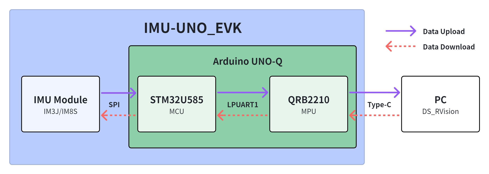
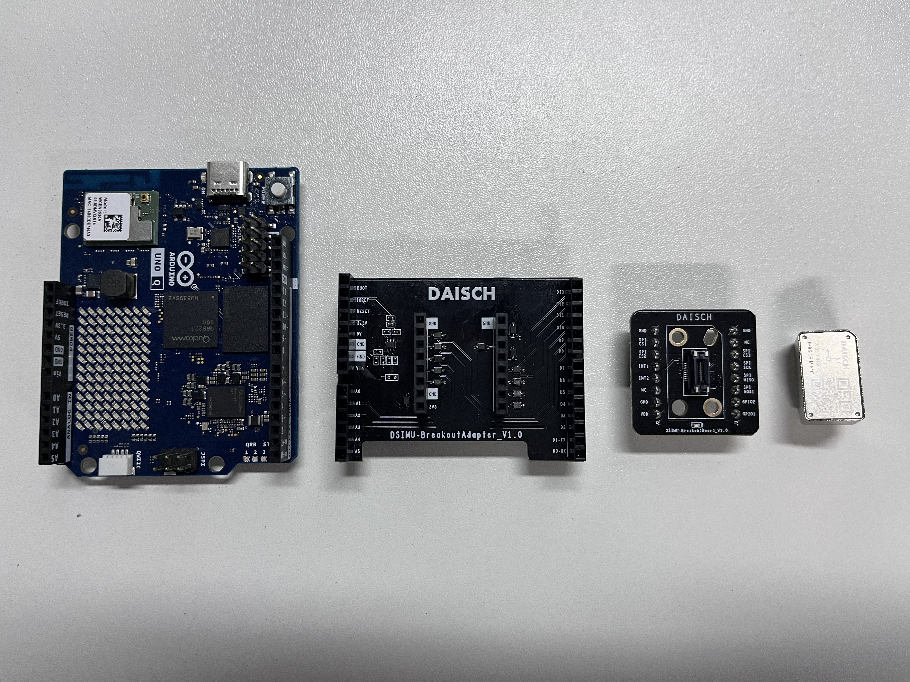
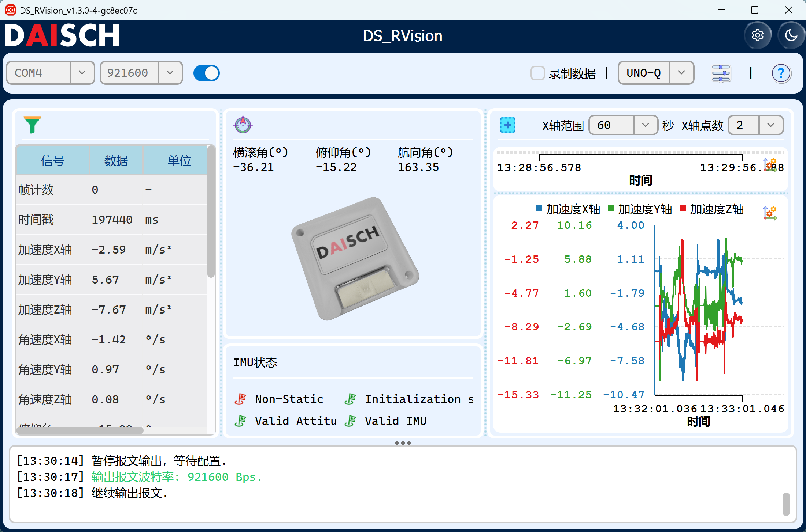
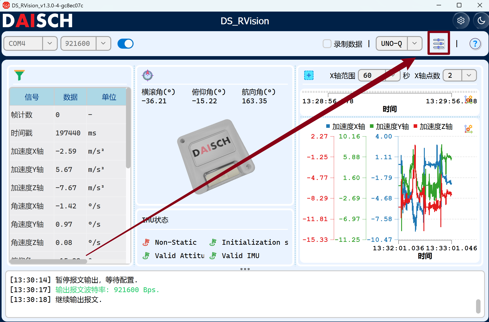
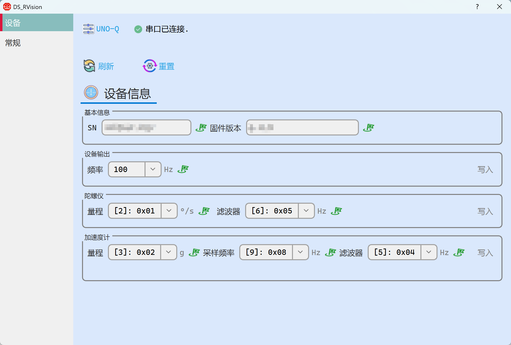

<div align="right">

**English** | [简体中文](../zh-CN/Quick_Start.zh-CN.md)

</div>


---

# 🚀 IMU-UNO_EVK Quick Start Guide

This guide walks you through six steps to complete the whole workflow from hardware setup to IMU data output based on the **IMU-UNO_EVK**.

**Step Overview:**  
1. [Setup Development Environment](#section1)  
2. [Hardware Connection](#section2)  
3. [SDK Replacement](#section3)  
4. [Project Build](#section4)  
5. [Firmware Flashing](#section5)  
6. [Data Passthrough Configuration](#section6)  
7. [View Data on Host PC](#section7)  

**IMU-UNO_EVK System Block Diagram:**



---

## 📌 1. Development Environment <a name="section1"></a>

The development environment for this project:

* **OS**: Ubuntu 22.04  
* **Zephyr version**: v4.3.0  
* **Zephyr SDK**: v1.0.0  

### 🔧 Environment Setup

Please refer to the official Zephyr documentation to set up the environment:

* 👉 Linux dependencies installation  
  [https://docs.zephyrproject.org/latest/develop/getting_started/installation_linux.html#installation-linux](https://docs.zephyrproject.org/latest/develop/getting_started/installation_linux.html#installation-linux)

* 👉 Zephyr environment initialization  
  [https://docs.zephyrproject.org/latest/develop/getting_started/index.html](https://docs.zephyrproject.org/latest/develop/getting_started/index.html)

---

## 🔌 2. Hardware Connection <a name="section2"></a>

### 📍 2.1 Hardware Overview



---

### 📍 2.2 Hardware Assembly
This kit uses a stacked assembly method as shown below:


---

## 📦 3. SDK Replacement <a name="section3"></a>

Please refer to:

[README_SDK_REPLACE.md](../en/README_SDK_REPLACE.md)

---

## ⚙️ 4. Project Build <a name="section4"></a>

### 🧩 Conditional Compilation

Navigate to the project root directory.

Select the build target according to your IMU model:

#### ✔ Build for IM3J

```bash
west build -b arduino_uno_q -- -DIMU_TARGET=IM3J
```
> Before obtaining the official SDK static library, you can use the provided "stub library" (header files and empty function definitions only) to verify the build process and environment configuration. The command is:  
> `west build -b arduino_uno_q -- -DIMU_TARGET=IM3J_STUB`

#### ✔ Build for IM8S

```bash
west build -b arduino_uno_q -- -DIMU_TARGET=IM8S
```
> Before obtaining the official SDK static library, you can use the provided "stub library" (header files and empty function definitions only) to verify the build process and environment configuration. The command is:  
> `west build -b arduino_uno_q -- -DIMU_TARGET=IM8S_STUB`

---

### 📁 Build Output

After a successful build, the following file is generated:

```bash
build/zephyr/zephyr.bin
```

---

## 🔥 5. Firmware Flashing <a name="section5"></a>

### 1️⃣ Transfer the Firmware
Connect the PC to the device using a Type‑C data cable as shown:


Use ADB to transfer `zephyr.bin` to the UNO_Q:

```bash
adb push "/path/to/zephyr.bin" /path/to/device/
```

---

### 2️⃣ Enter the OpenOCD Directory

```bash
cd /opt/openocd
```

---

### 3️⃣ Flashing Command

```bash
sudo /bin/openocd \
  -f /openocd_gpiod.cfg \
  -c "init; reset halt; flash write_image erase /path/to/zephyr.bin 0x08000000; reset; shutdown"
```

---

## 🔧 6. Data Passthrough Configuration <a name="section6"></a>

See [Data Passthrough Configuration](../en/Data_Passthrough_Configuration.md)

---

## ✅ 7. View Data on Host PC <a name="section7"></a>

**Open the host software and connect to the kit:**

* IMU data is output via Type‑C  
* You can obtain **attitude angles (Roll / Pitch / Yaw), 6‑axis acceleration and angular velocity**, etc.



**IMU Parameter Configuration:**

You can configure the parameters in the **"Device Information Configuration"** section at the upper right corner.



For detailed descriptions of each configuration item, please refer to the following documents:
- [IM3J_Configuration_Mapping_Guide.md](IM3J_Configuration_Mapping_Guide.md)
- [IM8S_Configuration_Mapping_Guide.md](IM8S_Configuration_Mapping_Guide.md)



---